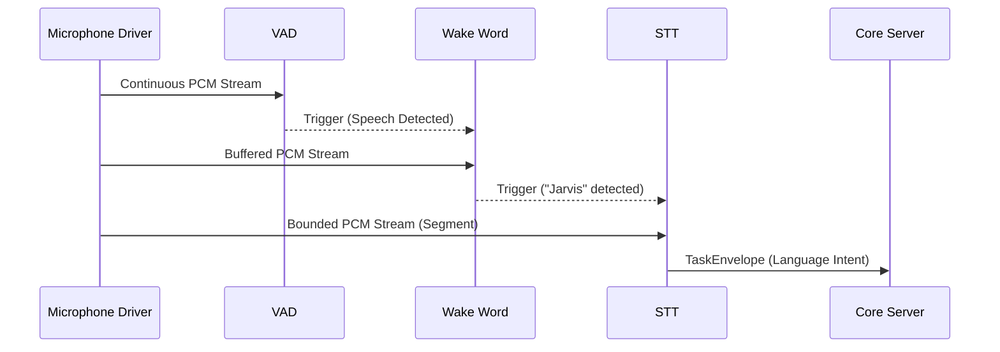
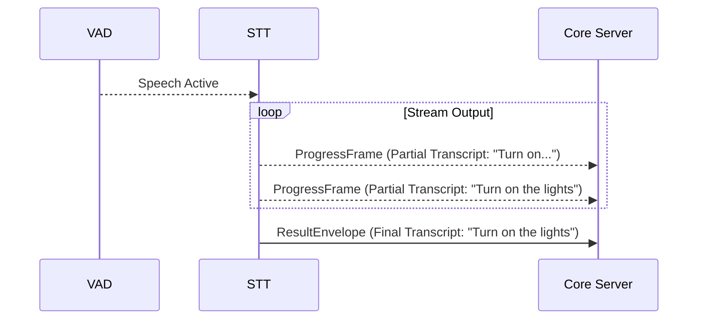
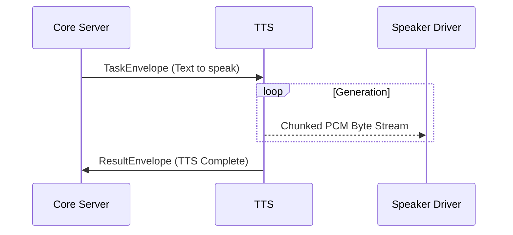
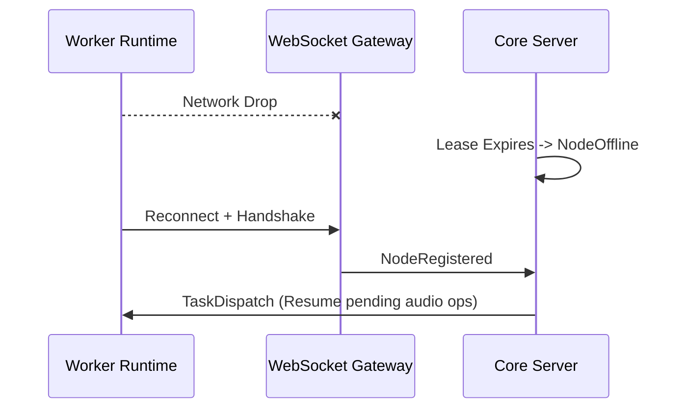
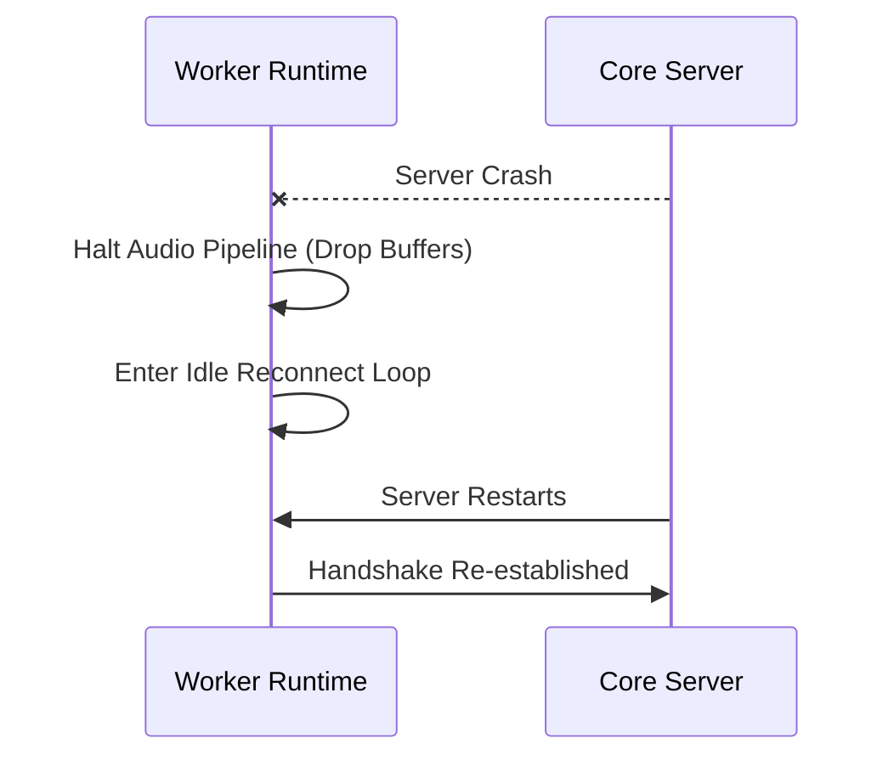

# Phase 9: Audio Intelligence (Bangla-First)
## Architecture Review Document (ARD)

### Mission
We are beginning Phase 9 of Jarvis Core.
This subsystem is the **Audio Intelligence** component of the Human Interaction Platform. 
It is NOT a "Voice Assistant" nor is it just "Speech Recognition." It is a fundamental sensory input and output medium designed specifically for continuous passive listening, ultra-low CPU idle operation, streaming capability, and Bangla-first interaction. 

It strictly complies with the Five Fundamental Laws of Jarvis. **The Brain NEVER receives raw audio.** It receives only structured language. Raw microphone samples terminate exclusively inside the Worker Runtime.

---

### Architectural Goals
The subsystem provides:
- Continuous passive listening with ultra-low CPU idle operation.
- Bangla-first interaction, alongside robust English support.
- Streaming speech recognition (STT).
- Streaming speech synthesis (TTS).
- Completely stateless workers compliant with the distributed Worker Platform.
- Total hardware independence.

---

### Architectural Principle
The primary directive is absolute separation of sensory raw data and cognitive intelligence:
**The Brain NEVER receives raw audio. The Brain only receives structured language.**

#### Inbound Pipeline (Audio → Language)
`Microphone Driver` → `Ring Buffer` → `Voice Activity Detection (VAD)` → `Wake Word Detection` → `Speech Segment Builder` → `STT Plugin` → `TaskEnvelope` → `Core Server` → `Brain`

#### Outbound Pipeline (Language → Audio)
`Brain` → `ResultEnvelope` → `TTS Plugin` → `PCM Audio` → `Speaker Driver`

---

### Component Responsibilities

- **Audio Driver**: The lowest-level native interface (e.g., ALSA, CoreAudio, WASAPI) that pulls byte streams from physical microphones.
- **Ring Buffer**: A fixed-size, continuous circular memory array that holds the most recent N seconds of PCM audio to prevent dropping the beginning of speech during plugin spin-up.
- **VAD (Voice Activity Detection)**: An ultra-lightweight heuristic or tiny neural model that runs continuously, detecting human speech vs background noise. Triggers the Wake Word system.
- **Wake Word Plugin**: A localized, low-overhead keyword spotter. It continuously analyzes the Ring Buffer once VAD is active, looking for the specific trigger phrase.
- **Speech Segment Builder**: Aggregates continuous PCM audio frames following a wake word trigger until VAD determines speech has ceased, bounding the chunk for the STT engine.
- **STT Plugin**: Streams the speech segment into text representations (Bangla/English) and emits final strings inside a `TaskEnvelope` to the Core Server.
- **TTS Plugin**: Ingests strings from the Core Server via `TaskEnvelope`s and generates synthesized PCM audio streams.
- **Speaker Driver**: The native interface that pipes generated PCM audio directly to the physical output hardware.
- **Audio Session Manager**: Orchestrates the local pipeline (VAD → Wake Word → STT) and manages locking/halting local inputs when TTS is currently speaking (Half-Duplex mode).
- **Conversation Session**: The logical structure residing entirely in the Core Server that maintains dialogue history and context.

---

### Worker Responsibilities
**Worker owns:**
- Audio Capture & PCM Buffers
- Audio Drivers
- Wake Word & VAD
- Speech Segmentation
- Streaming STT & Streaming TTS
- Temporary Audio Cache

**Worker NEVER owns:**
- Conversation History or User Identity
- Memory or Knowledge
- Planning, Reasoning, World Model, or Personal Intelligence

---

### Core Responsibilities
**Core owns:**
- Conversation Context & Intent
- Planning & Reasoning
- Memory & Knowledge
- World Model & Learning
- Personal Intelligence

---

### Streaming Model
- **Low-latency Streaming STT**: Audio segments are piped to the STT model incrementally. Intermediate transcripts are emitted for UI updates; final transcripts trigger intent logic.
- **Chunk & Buffer Size**: Optimized for human cadence (e.g., 20ms-50ms chunks).
- **Ring Buffer**: Maintains a continuous rolling window (e.g., 2-3 seconds) to capture pre-wake-word context.
- **Sample Rates & PCM Formats**: Standardized to 16kHz, 16-bit Mono PCM for processing efficiency.
- **Voice Interruption (Barge-in)**: The Audio Session Manager will halt the current TTS execution if VAD + Wake Word are triggered by the user mid-sentence.
- **Duplex Mode**: Initial architecture guarantees Half-Duplex (cannot speak and listen processing concurrently without echo cancellation). Future Full-Duplex support requires acoustic echo cancellation (AEC) drivers.

---

### Bangla First Design
The STT and TTS plugins are structurally configured to default to Bangla linguistic spaces.
- **Support**: Native Bangla, native English, and seamless Mixed Bangla-English (Code-switching).
- **Language Auto Detection**: The STT pipeline will natively tag segments with predicted languages without explicit manual toggles.
- **Future Multilingual Routing**: Architecture supports spawning localized language capabilities dynamically based on detected linguistic context.

---

### Plugin Contracts
*Draft representations of the Capability Manifests. These govern what a plugin provides to the cluster.*

- **MIC_CAPTURE**: `{ requiredDrivers: ['ALSA', 'CoreAudio'], sampleRates: [16000, 44100], estimatedLatency: 5, artifactSupport: true, streamSupport: true }`
- **VAD**: `{ requiredMemory: '10MB', requiredCPU: 'UltraLow', estimatedLatency: 10, streamSupport: true }`
- **WAKE_WORD**: `{ requiredMemory: '50MB', requiredCPU: 'Low', optionalGPU: false, estimatedLatency: 50, languages: ['bn', 'en'] }`
- **STT**: `{ requiredMemory: '2GB', requiredCPU: 'High', optionalGPU: true, estimatedLatency: 200, languages: ['bn', 'en', 'mixed'], streamSupport: true }`
- **TTS**: `{ requiredMemory: '1GB', requiredCPU: 'Medium', optionalGPU: true, estimatedLatency: 150, languages: ['bn', 'en'], streamSupport: true }`
- **SPEAKER_OUTPUT**: `{ requiredDrivers: ['ALSA', 'CoreAudio'], sampleRates: [24000, 44100], estimatedLatency: 10, streamSupport: true }`

---

### Driver Contracts
*Interfaces mapping hardware to the Worker Sandbox.*
- **AudioDriver**: Initializes recording devices, handles buffer interrupts, yields raw bytes.
- **SpeakerDriver**: Claims playback devices, accepts PCM byte streams for output.
- **AudioDevice**: Hardware profile mapping (device ID, channels, max bitrate, supported sample rates).
- **BufferProvider**: The memory management abstraction for the Ring Buffer to avoid GC pauses.
- **ClockProvider**: Synchronization anchor for aligning STT transcripts with exact timestamp offsets.

---

### Failure Modes
- **Microphone Unplugged**: Driver throws fatal error. Worker flags MIC capability as `OFFLINE`. Core routes to alternate sensory inputs.
- **No Speech / Noise / Echo**: VAD drops confidence. Pipeline halts before waking STT engine. CPU remains idle.
- **Dropped Packets**: Ring Buffer identifies gap, injects silence padding to prevent STT model hallucination.
- **Worker Restart**: Perfectly safe. Worker holds no state. New connection registers capabilities automatically.
- **Core Disconnect**: Audio pipeline halts to prevent orphaned resource burn. Wait for WebSocket reconnect.

---

### Security
- **No permanent storage** of raw audio anywhere in the pipeline unless explicitly requested.
- **No conversation history** is retained inside the Worker memory.
- **Hardware Isolation**: No plugin may access physical microphones directly; all access must flow through the strictly typed `DriverAdapter`.

---

### Privacy
- **Default Mode**: Streaming only. Real-time analysis with immediate buffer disposal.
- **No Recording**: By default, no persistent wav files are generated.
- **Optional Recording**: If a memory/recording is explicitly requested, it must be generated as an `ArtifactRef` and streamed to an object store (MinIO).
- **Persistence Rules**: Audio is NEVER stored in PostgreSQL or Qdrant vector spaces.

---

### Scalability
The audio pipeline handles localized compute dynamically, allowing identical architecture execution across:
- High-end Desktops & Laptops (Local STT/TTS).
- Mini PCs & Jetson Nano (Edge inference).
- Android mobile devices.
- Cloud Workers (API bridging).
- Future autonomous robots.
*This scales without requiring a single modification to the Jarvis Brain.*

---

### Sequence Diagrams

#### 1. Wake Word Conversation

#### 2. Continuous Streaming STT

#### 3. Streaming TTS

#### 4. Worker Reconnect

#### 5. Core Failure Recovery

---

### Future Extensions
The abstraction natively supports extending capabilities **without modifying existing architecture**:
- **Speaker Identification**: Biometric tagging of segments to identify *who* is speaking.
- **Voice Authentication**: Secure intents via local biometric validation.
- **Emotion Detection**: Tagging segments with sentiment (e.g., urgency) passed as metadata to Core.
- **Keyword Spotting**: Non-wake-word triggers for continuous environmental awareness.
- **Noise Classification**: Tagging environments (e.g., "in a car") for adaptive response strategies.
- **Meeting Mode**: Multi-channel diarization.
- **Realtime Translation**: Pipeline-injected translation layers.
- **Voice Cloning**: Custom TTS models loaded via new dynamic capabilities.
- **Conversation Memory Summaries**: Automatic linguistic summarization via Brain pipelines.
