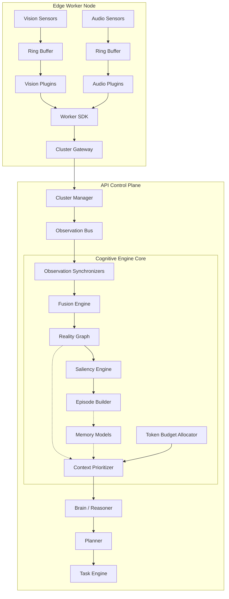

# Jarvis Core – Project Status & Architecture Inventory

## 1. Executive Summary
Jarvis Core is rapidly maturing from a conceptual AI OS into a highly modular, distributed platform. The architectural boundaries between the central control plane (`api`), the edge intelligence clients (`worker-node`), and the cognitive reasoning systems (`core`) are heavily formalized. 

**Current Maturity:**
- **Platform Foundation:** High. NestJS modules are deeply structured and properly separated.
- **Distributed Cluster:** High. Core interfaces and gateways exist for multi-worker coordination and execution.
- **Worker Platform:** Medium. The runtime, ring buffers, and SDK are strictly implemented, but physical sensory providers are heavily mocked.
- **Cognitive Engine:** Medium. Phase 11 implemented the Reality Graph, Fusion, and Token Budgeting correctly, but it remains an in-memory sandbox.
- **Voice & Vision:** Low-Medium. Architecture is complete (ring buffers, VAD, ROI managers), but entirely backed by mock drivers.
- **Brain (Planner/Reasoner):** Medium. Extensive scaffolding exists in the API for reasoning, intent, and execution, pending active wiring to the Worker execution loop.

---

## 2. Completed Phases

### Phase 8: Worker Platform
- **Status:** Completed
- **Description:** Established the distributed edge-node infrastructure.
- **Major Modules:** `apps/worker-node/src/execution`, `apps/worker-node/src/sdk`, `apps/worker-node/src/runtime`
- **Important Contracts:** Capability Plugins, Sandbox Executors.
- **Current Maturity:** Foundationally solid, ready for real plugin execution.

### Phase 9: Audio & Vision Intelligence
- **Status:** Completed
- **Description:** Continuous multi-modal sensory ingestion for the edge node.
- **Major Modules:** `apps/worker-node/src/audio`, `apps/worker-node/src/vision`
- **Important Contracts:** `VisionProvider`, `AudioDriver`, `VADProvider`, `WakeWordProvider`
- **Current Maturity:** Scaffolding complete, but heavy reliance on Mock drivers in place of real ML models.

### Phase 11: Cognitive Observation & Fusion Engine
- **Status:** Completed
- **Description:** Transient reality tracking, biological saliency filtering, and prompt context budgeting.
- **Major Modules:** `apps/core/src/cognitive/engines`, `apps/core/src/cognitive/context`, `apps/core/src/cognitive/models`
- **Important Classes:** `CognitiveOrchestrator`, `FusionEngine`, `TokenBudgetAllocator`
- **Current Maturity:** Logically complete, strictly typed, but currently disconnected from persistent vector databases.

---

## 3. Current Architecture

**Core Server (`apps/api`):** The primary brain and control plane. It hosts the Knowledge base, Memories, World Model, Personal Intelligence, and the central Router/Task Engine.

**Worker Runtime (`apps/worker-node`):** The sensory edge node. It captures Audio and Vision via Ring Buffers, applies local gates (VAD/Wake-word), and prepares execution sandbox environments.

**Cluster:** The network bridge coordinating the API Brain with the distributed Worker Nodes.

**Observation & Fusion:** Workers stream data to the Observation Bus, where the Fusion Engine resolves conflicts and updates the Reality Graph.

**Reality Graph & Episode Builder:** The Reality Graph tracks transient state. The Saliency Engine scores state changes dynamically, and the Episode Builder chunks highly salient events into narrative memories.

**Brain (Context, Planner, Execution):** The Context Prioritizer applies token budgets to memories, reality, and knowledge before feeding the Planner/Reasoner, which queues tasks for Execution.

---

## 4. Repository Inventory

**`apps/api/src/modules/`**
- `ai`
- `audit`
- `auth`
- `brain` (context, execution, intent, planner, reasoner, registry, router, task-engine)
- `cluster` (contracts, events, gateways, providers, services)
- `conversations`
- `execution`
- `health`
- `inference`
- `knowledge`
- `memories`
- `observation`
- `perception`
- `personal-intelligence`
- `registry`
- `runtime`
- `sessions`
- `workers` (embedding, inference)
- `world-model`

**`apps/worker-node/src/`**
- `audio` (buffer, core, driver, gates, gateway, plugins, providers, session)
- `vision` (buffer, camera, contracts, models, optimization, plugins, providers)
- `execution`
- `runtime`
- `sdk`

**`apps/core/src/`**
- `cognitive` (context, contracts, engines, models)

**`packages/`**
- `database` (PostgreSQL schemas, `memory-origin`, `memory-type`)

---

## 5. Implemented Features
- ✅ Planner
- ✅ Reasoner
- ✅ Task Engine
- ✅ Cluster Manager
- ✅ Observation Bus
- ✅ Worker SDK
- ✅ Audio/Vision Ring Buffers
- ✅ Reality Graph
- ✅ Context Token Budget Allocator
- ✅ Saliency Engine

---

## 6. Architecture Documents
- `docs/architecture/phase-8-worker-platform-ard.md`
- `docs/architecture/phase-9-audio-intelligence-ard.md`
- `docs/architecture/phase-11-cognitive-fusion-ard.md`

---

## 7. Current Technical Debt
- **TODOs:** `apps/worker-node/src/vision/optimization/roi-manager.ts` requires implementation of native buffer crop (e.g., via sharp or OpenCV).
- **Mock Providers:** The entire Worker sensory layer is mocked (`mock-tts-provider`, `mock-stt-provider`, `mock-scene-provider`, `mock-face-provider`, `mock-ocr-provider`, `mock-camera-driver`, `mock-audio-driver`, `mock-vad-provider`, `mock-wake-word-provider`).
- **In-Memory Repositories:** `CognitiveOrchestrator` uses an in-memory array (`longTermMemory`) and `console.log` for saving episodes instead of a real database connection.
- **Simulated Event Loops:** The `CognitiveOrchestrator` uses `setInterval` and dummy event triggers rather than actual Pub/Sub listeners to the `ObservationBus`.

---

## 8. Missing Integrations
- **Reality Graph / Episode Builder ⭢ Memory API:** `CognitiveOrchestrator` is not connected to the `apps/api/src/modules/memories` repositories.
- **Observation Bus ⭢ Fusion Engine:** The active `ObservationBus` in the API is not live-streaming payloads to the `CognitiveOrchestrator` in `apps/core`.
- **Token Budget Allocator ⭢ Brain:** The Context Prioritizer successfully chunks limits, but the API `brain/reasoner` is not actively querying this fitted context for LLM prompts.
- **Brain ⭢ Worker Execution:** The planner queues tasks, but the reverse-bridge (Action Bus) pushing commands down to the Worker Sandbox is incomplete.

---

## 9. Remaining Roadmap

**High Priority:**
- Replace Voice/Vision Mock Providers with actual hardware bindings (OpenCV, Whisper, TTS models).
- Connect `CognitiveOrchestrator` (Core) to the `ObservationBus` (API) and PostgreSQL/Vector database (Packages/DB).
- Wire the `ContextPrioritizer` output to the `Brain` LLM Reasoner prompts.

**Medium Priority:**
- Resolve ROI Manager TODO for native image buffer cropping.
- Implement the Action Bus to transmit Planner intentions to Worker Node Sandboxes.

**Future:**
- Active feedback loops for `Personal Intelligence` and `World Model`.
- Multi-node distributed tracing and clustering metrics.

---

## 10. Production Readiness
- **Type safety:** 9/10
- **Modularity:** 9/10
- **Scalability:** 8/10
- **Distributed readiness:** 8/10
- **Security boundaries:** 7/10
- **Worker isolation:** 8/10
- **Context architecture:** 8/10
- **Storage architecture:** 4/10

---

## 11. Final Architecture Diagram

